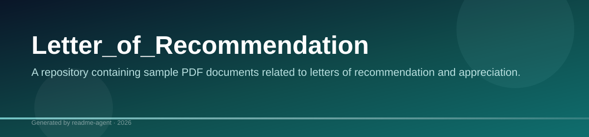
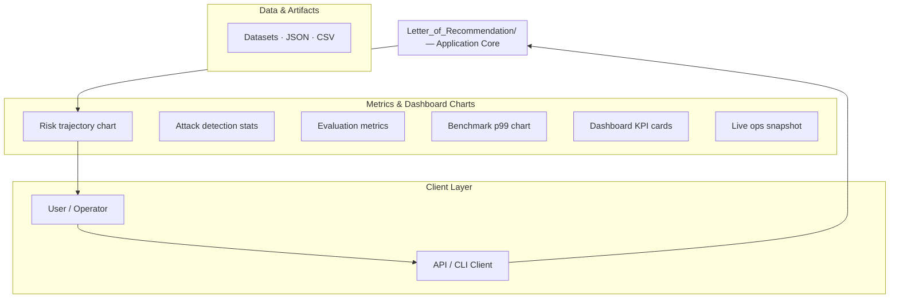
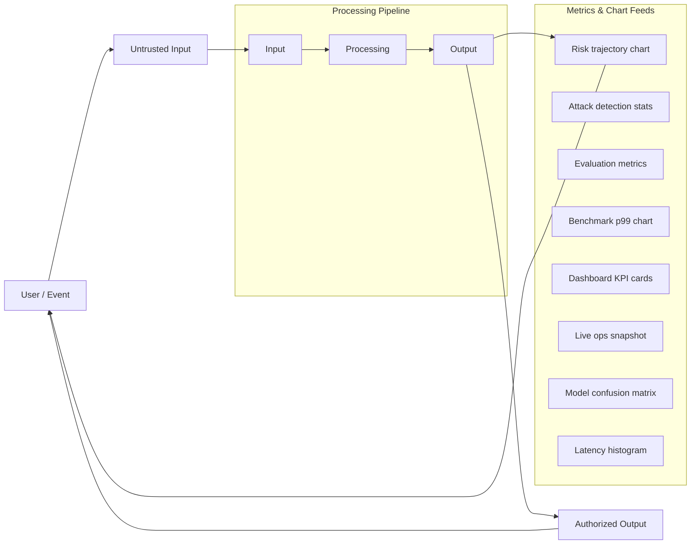
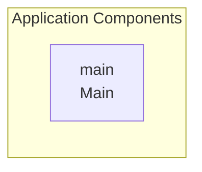

# Letter_of_Recommendation

A repository containing sample PDF documents related to letters of recommendation and appreciation.

## Overview

The repository currently contains several PDF files, which appear to be examples of letters of recommendation and appreciation. No source code, dependencies, or configuration files were found in the scan.

## Key Features

- Unavailable

## Letter_of_Recommendation

A repository containing sample PDF documents related to letters of recommendation and appreciation.

### Overview

The repository currently contains several PDF files, which appear to be examples of letters of recommendation and appreciation. No source code, dependencies, or configuration files were found in the scan.

### Project Structure

The repository contains four PDF files in the root directory, serving as examples of recommendation and appreciation letters:

*   `DYO-central-delhi-Letter of Appreciation and Recommendation.pdf`
*   `LOR-Punya_Mittal-Uber.pdf`
*   `LOR_ANALYTX4T.pdf`
*   `Punya_Mittal_Letter_of_Recommendation_Black-Duck.pdf`

### Limitations

*   The repository only contains static PDF files and lacks any executable code or functional components.

### Future Improvements

*   Adding source code or functional components to demonstrate the use of the recommendation letters.

## Setup Guide

_Setup commands could not be extracted from the repository._

## System Architecture

High-level system design, data flows, API map, and workflow pipelines derived from the repository structure.

### System Architecture

### Data Flow & Charts Pipeline

### Component & API Map

